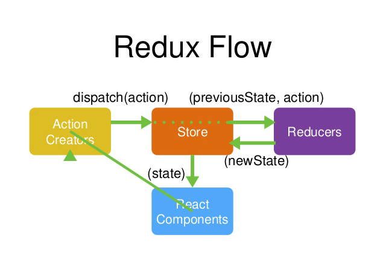

### React

npm -v 5.5.1

- node 7.10.1

#### install react-cli

- npm install -g create-react-app

#### create-react-app 创建 react

- create-react-app todolist 旧版本使用方式
- npx create-react-app todolist 最新版本使用方式

> todolist/
>
> > node_modules/
> > public/
> > src/
> >
> > > index.js 整个项目的入口文件
> > > .gitignore
> > > package.json
> > > README.md
> > > yarn.lock

#### this

- React 方法中的 this 默认指向 undefined
- 需要 bind 绑定 this 改变指向组件
- e: this.handleClick.bind(this)
- 在 constructor 中修改 this 指向 this.handleClick = this.handleClick.bind(this)

#### state

- 更改 state 值需要使用 setState 来修改

```jsx
<ul>
  {this.state.list.map((item, index) => {
    // 不要使用index做key值
    return <li key={index}>{item}</li>;
  })}
</ul>
```

```jsx
  handleItemDel(_id) {

    console.log(_id)
    // immutable
    // state不允许做任何的改变
    const list = [...this.state.list]  // 利用浅拷贝赋值最新的数组
    list.splice(_id, 1)
    this.setState({
      list: list
    })
  }

```

#### jsx 注释

```jsx
{
  // todolist
}
{
  /**
   * todolist
   * */
}
```

#### clasName 定义 Css 样式类名

#### dangerouslySetInnerHTML 是 React 为浏览器 DOM 提供 innerHTML 的替换方案

- \_\_html 是两个下划线 item 为内容

```jsx
this.state.list.map((item, index) => {
  return <li dangerouslySetInnerHTML={{ __html: item }}></li>;
});
```

#### htmlFor 替代了 label 中的 for

### props 组件传值

> 父组件向子组件传值 子组件通过 props 接收

```jsx
// 父组件
<ul>
  {this.state.list.map((item, index) => {
    return <TodoItem content={item} />; // 这是子组件 content为传递内容的变量 item为子组件接收的内容
  })}
</ul>
```

```jsx
// 子组件
class TodoItem extends Component {
  render() {
    return <li>{this.props.content}</li>; // 通过props接收父组件传递过来的内容
  }
}
```

> 子组件向父组件传值 通过事件传递

```jsx
// 父亲组件需要改变this指向使用bind绑定this，将方法和内容索引值传递给子组件
<ul>
  {this.state.list.map((item, index) => {
    return (
      <TodoItem
        handleItemDel={this.handleItemDel.bind(this)}
        content={item}
        key={index}
        index={index}
      />
    );
  })}
</ul>;
// 通过触发子组件的方法调用父组件的方法

class TodoItem extends Component {
  constructor(props) {
    super(props);
    this.handleClick = this.handleClick.bind(this);
  }

  handleClick() {
    // 子组件的方法
    this.props.handleItemDel(this.props.index);
  }
  render() {
    return <li onClick={this.handleClick}>{this.props.content}</li>;
  }
}
```

### todolist 优化

```jsx
// 将渲染出来的list封装成方法
  getTodoItem() {
    return this.state.list.map((item, index) => {
      return (
        <TodoItem
          delItem={this.handleDelItem}
          key={index}
          index={index}
          content={item}
        />
      )
    })
  }

// 调用方法
<ul>
  { this.getTodoItem() }
</ul>
```

```jsx
handleChange(e) {
    const value = e.target.value // 需要对e.target.value进行保存一下
    this.setState(() => ({ // 此处的setState是一个异步函数
      inputValue: value
    }))
}

handleClick() {
  if (this.state.inputValue === '') return
  this.setState((prevState) => ({ // 此处的参数prevState===等价于 this.state 是为了防止直接修改state的值
    list: [...prevState.list, prevState.inputValue],
    inputValue: ''
  }))
  // this.setState(() => ({
  //   list: [...this.state.list, this.state.inputValue],
  //   inputValue: ''
  // }))
}

handleDelItem(_id) {
  this.setState((prevState) => {
    const list = [...prevState.list]
    list.splice(_id, 1)
    return { list }
  })
}
```

#### PropTypes

````jsx
import PropTypes from 'prop-types'
TodoItem.propTypes = {
  content: PropTypes.string.isRequired
}

// week父组件没有传 默认传值
TodoItem.defaultProps = {
  week: 'sunday'
}
```jsx

> - 当父组件的render函数被执行时它的子组件的render都将被重新运行

#### 虚拟DOM (虚拟DOM就是一个JS对象，用它来描述真实DOM)
- 1. state - 数据
- 2. jsx模板
- 3. state数据 + jsx模板 结合生成真实的DOM
- 4. state 若发生改变
- 5. state数据 + jsx模板 结合生成真实的DOM，替换原来的DOM
> 缺陷：
> > - 第一次生成了一个完整的DOM片段
> > - 第二次生成了一个完整的DOM片段
> > - 第二次的DOM替换第一次的DOM非常消耗性能

- 1. state - 数据
- 2. jsx模板
- 3. state数据 + jsx模板 结合生成真实的DOM
- 4. state 若发生改变
- 5. state数据 + jsx模板 结合生成真实的DOM，并不替换原来的DOM
- 6. 新的DOM 和原来的DOM做对比
- 7. 找出局部变化了元素
- 8. 只用新的DOM中发生变化了的局部元素，替换掉老的DOM中的被改变的局部元素
> 缺陷：
> > - 性能提升不明显

- 1. state - 数据
- 2. jsx模板
- 3. state数据 + jsx模板 结合生成虚拟DOM
```js
['div', {id: 'abc'}, {'span', {}, 'hello span'}]
````

- 4. 用虚拟 DOM 的结构生成真实的 DOM

```html
<div id="abc"><span>hello span<span></div>
```

- 5. state 若发生改变
- 6. state 数据 + jsx 模板生成新的虚拟 DOM (极大的提升了性能)

```js
['div', {id: 'abc'}, {'span', {}, 'bye span'}]
```

- 7. 比较原始虚拟 DOM 和新的虚拟 DOM 的区别，找出区别是 span 中的内容
- 8. 直接操作 DOM，改变 span 中的内容
     > 优点：
     >
     > > - 性能提升了(DOM 的比对是 JS 对象之间的比对)
     > > - 它是的跨端应用得以实现，React Native

### Diff

- React 的虚拟 DOM 是同层比对的

#### Ref 尽量避免使用

- ref 是帮助在 React 里面直接获取 DOM 元素的时候来使用的
- 比如在做动画的时候使用获取 DOM 元素
- ref 和 setState 一起用的时候 setState 异步函数 在 setState 第二个参数回调函数使用

```jsx
handleClick() {
  if (this.state.inputValue === '') return
  this.setState((prevState) => ({ // 此处的参数prevState===等价于 this.state 是为了防止直接修改state的值
    list: [...prevState.list, prevState.inputValue],
    inputValue: ''
  }), () =>{
    console.log(this.ul.querySelectorAll('li').length)
  })
}
```

#### 生命周期

- componentWillMount() React 17 版本以弃用
- render()
- componentDidMount() 组件加载页面之后自动执行
- shouldComponentUpdate() 组件更新之前自动执行 返回 boolean 值

```jsx
// TodoItem.js 子组件
shouldComponentUpdate(nextProps, nextState) {
  if (nextProps.content !== this.props.content) {
    return true
  } else {
    return false
  }
}
```

- componentWillUpdate(nextProps, nextState) 是否执行取决于 shouldComponentUpdate 的值 true 执行 false 不执行
- componentWillReceiveProps 1 从父组件接收到参数 2 如果这个组件第一次存在于父组件中，不会执行 3 如果这个组件之前已经存在于父组件中，才会执行
- componentDidUpdate() 除了首次 render 之后调用的是 componentDidMount 其他 render 结束之后调用的都是 componentDidUpdate
- componentWillUnmount() 组件卸载之前执行

#### charles 软件实现本地模拟数据

#### axios 请求数据 axios 放在 componentDidMount 函数里

```jsx
componentDidMount() {
  console.log('componentDidMount: 组件被挂载页面之后自动执行')
  axios.get('https://jsonplaceholder.typicode.com/posts')
    .then((data) => {
        const arr = [];
        data.data.map((item, i) =>
          i < 10 ? arr.push(JSON.stringify(item)) : false
        );
        this.setState((prevState) => {
          return {
            list: [...prevState.list, ...arr],
          };
        });
    })
    .catch(err => console.log(err))
}
```
#### CSS Transition 动画 第三方库 react-transition-group
- yarn add react-transition-group
```jsx
import { CSSTransition } from 'react-transition-group'

construcotr(props) {
  super(props)
  this.state {
    show: true
  }
}

changeStatus() {
  this.setState((prevState) => ({
    show: !prevState.show,
  }));
}

<CSSTransition in={this.state.show} timeout={1000}>
<h1>Hello React</h1>
</CSSTransition>
<button onClick={this.changeStatus}>CHANGE STATUS</button>
```
```css
.fade-enter {
  opacity: 0;
}
.fade-enter-active {
  opacity: 1;
  transition: opacity 1s ease-in;
}
.fade-enter-done {
  opacity: 1;
}

.fade-exit {
  opacity: 1;
}
.fade-exit-active {
  opacity: 0;
  transition: opacity 1s ease-in;
}
.fade-exit-done {
  opacity: 0;
}
```
- 多个组件使用动画库 需要引入 TransitionGroup
```jsx
import { CSSTransition, TransitionGroup } from "react-transition-group";

this.state = {
  list: []
}

changeStatus() {
  this.setState((prevState) => ({
    list: [...prevState.list, "item"],
  }));
}

<TransitionGroup>
  {this.state.list.map((item, index) => {
    return (
      <CSSTransition
        in={this.state.show}
        timeout={1000}
        classNames="fade"
        unmountOnExit
        onEntered={(el) => {
          el.style.color = "red";
        }}
        appear={true}
        key={index}
      >
        <h3>{item} CSS3 transition </h3>
      </CSSTransition>
    );
  })}
</TransitionGroup>
```

### Redux
- Redux = Reducer + Flux
#### Redux Flow
[Redux Flow](./redux.png)


- yarn add redux 安装redux
> Store的创建
> > src/store/index.js 
```js
import { createStore } from 'redux'
import reducer from './reducer' // 将笔记本引入进来
const store = createStore(reducer) // 将reducer传给store 此时的store对仓库数据一目了然

export default store
```
- store 相当于图书馆的管理员，需要一个笔记本来辅助自己管理数据reducer

> > src/store/reducer.js 笔记本创建
```js
// reducer.js 需要返回一个函数
// state仓库里所有的数据
// action 指的是用户从组件那边传过来的那句话
const defaultState = {
  inputValue: '',
  list: []
}
// reducer的作用是 reducer把处理过的信息返回一个新的数据给store
export default (state = defaultState, action) => {
  if(action.type === 'change_input_value') {
    // 首先拷贝之前store里面的数据
    const newState = JSON.parse(JSON.stringify(state)) //深拷贝state的数据
    newState.inputValue = action.value // action.value是传过来的值
    return newState // 将内容返回 替换了原来store里的数据 固定写法
  }
  return state
}
```

> > 接下来是组件连接store
```jsx
import store from './store' // 引入store

constructor(props) {
  super(props)
  this.state = store.getStore() // 获取store里的数据
}
componentDidMount() {
 // 订阅：当store数据发生改变之后 组件内容也需要更新变化，这时就需要store.subscribe订阅
 // 只要store发生改变 接收的参数方法就会自动执行一次
  store.subscribe(this.handleStoreChange) // 订阅store
}

handleStoreChange() {
 // 只要store发生变化 组件也就跟着变化
 this.setState(store.getState()) // 重新更新store的数据替换state的数据
}

handleChange(e) {
  const action = { // 告诉redux要做的事情 type必传
    type: 'change_input_value',
    value: e.target.value
  }
  store.dispatch(action) // 将这件事情告诉store
}
```

注意： [订阅放在构造函数里会报错 ](https://stackoverflow.com/questions/70348240/warning-cant-call-setstate-on-a-component-that-is-not-yet-mounted-this-is-a-n#comment124354616_70348240)

- 创建 actionTypes.js
```js
export const CHANGE_INPUT_VALUE = "change_input_value";
```
- action分离 创建actionCreators.js文件
- 导入常量actionTypes.js
```js
import {
  CHANGE_INPUT_VALUE
} from "./actionTypes";

export const getInputChangeAction = (value) => ({
  type: CHANGE_INPUT_VALUE,
  value,
});

```
- 组件使用
```jsx
import {
  getInputChangeAction,
  getAddItemAction,
  getDeleteItemAction,
} from "./store/actionCreators";

handleInputChange(e) {
  const action = getInputChangeAction(e.target.value);
  store.dispatch(action);
}
```
> createStore -> store.dispatch -> store.getState -> store.subscribe
